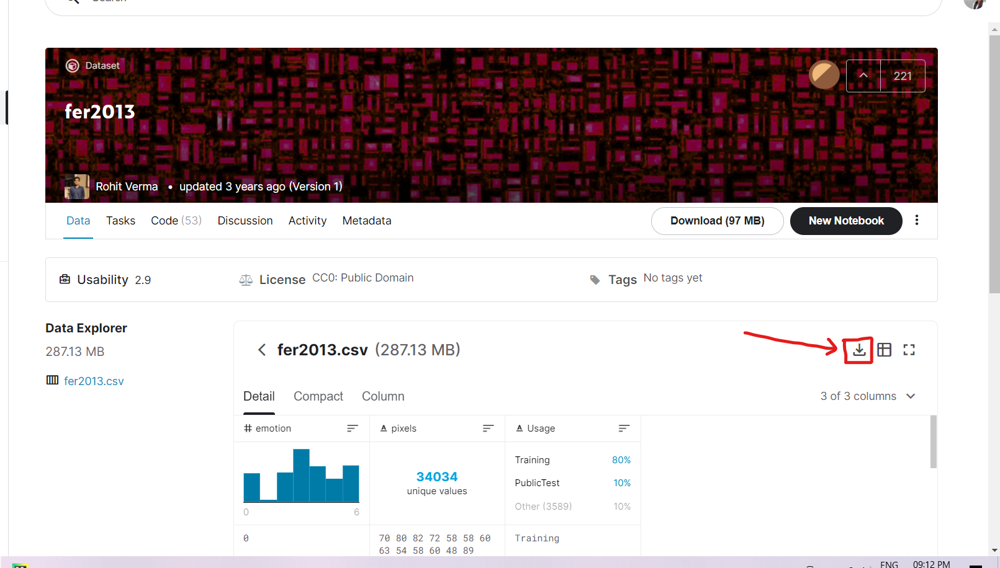

# Real-Time Emotion Detection
Automatic emotion recognition based on facial expression is 
an interesting research field, which has presented and applied 
in several areas such as safety, health and in human machine 
interfaces. Researchers in this field are interested in developing 
techniques to interpret, code facial expressions and extract these 
features in order to have a better prediction by a computer.
The limitations of computer vision have been lifted by the introduction of machine learning
As machine learning algorithms leverage the huge computation power 
of GPU’s, the image processing capabilities of the models fit
suitably with real world problems. Combining the statistical 
intelligence of machine learning algorithms and the processing 
power of GPU hardware, it is possible to create breakthrough 
models capable of detecting emotions from static images as 
well as video feeds.

##Packages and Libraries
- pip install opencv-python  
- pip install tensorflow  
- pip install numpy  
- pip install pandas    
- pip install keras  
- pip install adam    
- pip install kwargs  
- pip install cinit 

Or you can simply install all the libraries at once in terminal by typing
***pip install -r requirements.txt***

##Dataset
For training the dateset, I  have used the predefined untrained dataset CSV file 
as my main input for my input for training the machine.
Dataset from https://www.kaggle.com/deadskull7/fer2013?select=fer2013.csv 
(you can download it from here)

**Image Properties**: 48 x 48 pixels (2304 bytes) labels: 0=Angry, 1=Disgust, 2=Fear, 3=Happy, 4=Sad, 5=Surprise, 6=Neutral The training set consists of 28,709 examples. The public test set consists of 3,589 examples. The private test set consists of another 3,589 examples.

##Usage

###Pretraining the dataset:
- First download the dataset(fer2013.csv) then put it in the project folder
- Then run train_data.py
###Detecting realtime emotion:

- Run real-time-emotion.py after finishing training the dataset.

